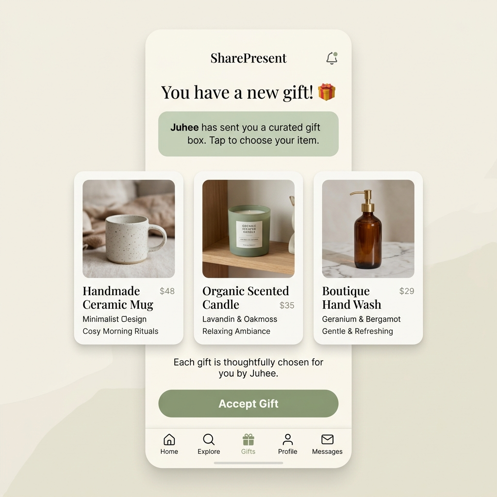
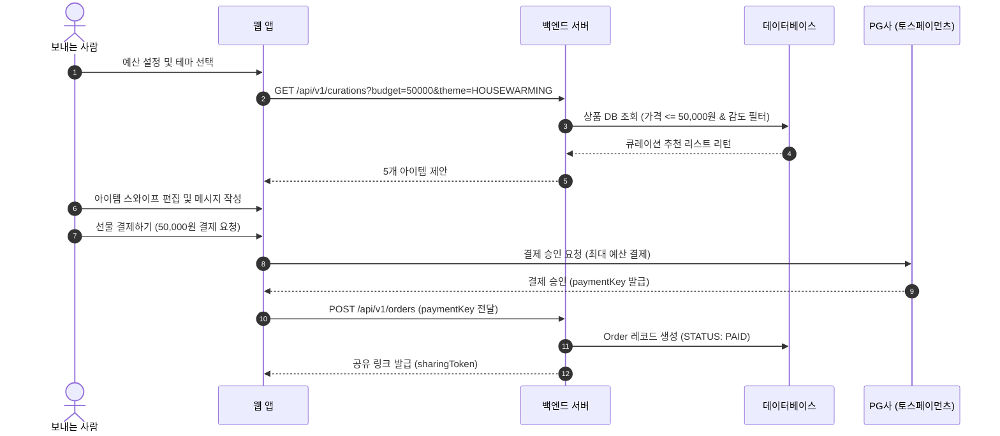
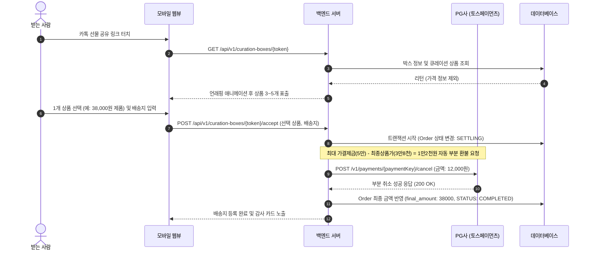

# SharePresent (선물 제안형 프리미엄 큐레이션 플랫폼)

> **"보내는 이의 예산 안에서, 받는 이에게 가장 높은 감도의 선택권을 선물하는 플랫폼"**
> 
> 기존 '카카오톡 선물하기'의 획일적이고 일방적인 선물 방식(Transactional UX)을 탈피하고, 선물을 주는 사람의 품격과 받는 사람의 소중한 취향을 모두 존중할 수 있도록 기획한 프로젝트입니다.

---

## 1. Product Vision & Target Audience

### 1) Core Vision
기존 모바일 선물하기는 주는 사람이 아이템을 '특정'하여 보냅니다. 이는 받는 사람의 실제 취향을 무시하거나 중복 선물의 문제를 야기합니다.  
**SharePresent**는 보내는 사람이 **'예산 한도(Budget Cap)'와 '큐레이션 테마'**를 선물하면, 받는 사람이 그 범위 내에서 **'자신의 취향에 맞는 최고의 선물 1개'**를 선택할 수 있게 하여 주는 사람의 체면과 받는 사람의 실용성을 극대화합니다.

### 2) Target Audience
- **Primary**: 감도 높은 라이프스타일을 지향하며 SNS(인스타그램 등)를 적극 활용하는 20~30대 직장인.
- **Secondary**: 평범한 모바일 쿠폰 대신 센스 있고 품격 있는 이사/승진/생일 선물을 보내고자 하는 스마트 컨슈머.
- **Corporate**: 비즈니스 파트너나 임직원에게 획일화된 명절 선물 세트 대신 프리미엄 편집숍 느낌의 세련된 모바일 카드를 전달하고자 하는 기업 고객.

---

## 2. UI/UX Concept & Unwrapping Experience

받는 사람이 선물을 받았을 때 단순한 링크가 아니라, 디지털 공간에서 명품 선물 상자를 여는 듯한 시각적/감성적 즐거움(Unwrapping Experience)을 느낄 수 있도록 인터랙션을 설계했습니다.

### 1) UI Mockup (받는 사람의 선물 수락 화면)


### 2) UX Key Interaction Points
- **WebGL/Framer Motion 기반 Ribbon-Cut**: 웹 접속 시 고급스러운 실크 리본이 스와이프를 통해 풀리며 기프트 카드 컬렉션이 아래에서 부드럽게 솟아오릅니다.
- **Swipe-to-Swap (보내는 사람 화면)**: 추천된 5개의 아이템 중 마음에 들지 않는 카드는 왼쪽으로 밀어(Swipe) 다른 프리미엄 대체품으로 바로 교체할 수 있습니다.
- **차액 비공개 (Blind Price Cap)**: 받는 사람에게는 금액이 노출되지 않으며, 오직 선물 고유의 밸류와 비주얼에만 집중할 수 있게 설계되었습니다.

---

## 3. Database Schema Design (ERD 기반 스펙)

다대다(M:N) 관계의 유연한 Curation Box 및 차액 환불(Partial Refund) 트랜잭션 관리를 위해 설계된 PostgreSQL 스키마입니다.

```sql
-- 1. 사용자 테이블 (보내는 사람 및 받는 사람 공통)
CREATE TABLE users (
    id SERIAL PRIMARY KEY,
    email VARCHAR(255) UNIQUE NOT NULL,
    nickname VARCHAR(100) NOT NULL,
    phone_number VARCHAR(20) NOT NULL,
    created_at TIMESTAMP DEFAULT CURRENT_TIMESTAMP
);

-- 2. 감도 높은 프리미엄 상품 테이블
CREATE TABLE products (
    id SERIAL PRIMARY KEY,
    brand_name VARCHAR(100) NOT NULL,
    product_name VARCHAR(255) NOT NULL,
    price INT NOT NULL,                  -- 원화 기준 정가
    description TEXT,
    image_url VARCHAR(512) NOT NULL,
    stock INT DEFAULT 100,
    category VARCHAR(50),                -- 푸드, 테이블웨어, 뷰티 등
    created_at TIMESTAMP DEFAULT CURRENT_TIMESTAMP
);

-- 3. 큐레이션 박스 테이블 (선물 상자)
-- 보내는 사람이 예산을 정해 생성한 1회성 선물 상자 그룹
CREATE TABLE curation_boxes (
    id SERIAL PRIMARY KEY,
    sender_id INT REFERENCES users(id),
    max_budget INT NOT NULL,             -- 보내는 사람이 설정한 최대 예산 한도
    message_card TEXT,                   -- 축하 메시지
    sharing_token VARCHAR(255) UNIQUE NOT NULL, -- 카카오톡/문자 전송용 고유 해시값
    status VARCHAR(50) DEFAULT 'CREATED', -- CREATED, PAID, SHARED, ACCEPTED, REFUNDED
    created_at TIMESTAMP DEFAULT CURRENT_TIMESTAMP,
    expired_at TIMESTAMP                 -- 유효기간 (기본 7일)
);

-- 4. 큐레이션 박스 내 추천 상품 매핑 테이블 (1:N)
-- 하나의 큐레이션 박스에 담기는 3~5개의 상품 리스트
CREATE TABLE curation_box_items (
    id SERIAL PRIMARY KEY,
    curation_box_id INT REFERENCES curation_boxes(id) ON DELETE CASCADE,
    product_id INT REFERENCES products(id),
    is_custom_added BOOLEAN DEFAULT FALSE -- 보내는 사람이 직접 커스텀 검색해서 추가했는지 여부
);

-- 5. 주문 및 트랜잭션 결제 테이블
-- 가결제 및 최종 확정 결제(차액 부분 취소)를 추적하기 위한 테이블
CREATE TABLE orders (
    id SERIAL PRIMARY KEY,
    curation_box_id INT REFERENCES curation_boxes(id),
    sender_id INT REFERENCES users(id),
    receiver_id INT REFERENCES users(id), -- 선물 수락 시점에 기록됨
    selected_product_id INT REFERENCES products(id), -- 최종 선택된 상품
    payment_key VARCHAR(255),            -- PG사(토스, 포트원) 결제 키
    total_amount INT NOT NULL,           -- 가결제 금액 (Max Budget)
    final_amount INT,                    -- 받는 사람이 고른 상품에 의한 최종 정산 금액
    refund_amount INT DEFAULT 0,         -- total_amount - final_amount (차액 환불액)
    recipient_name VARCHAR(100),
    recipient_phone VARCHAR(20),
    shipping_address TEXT,
    shipping_status VARCHAR(50) DEFAULT 'PENDING', -- PENDING, PREPARING, SHIPPED, DELIVERED
    paid_at TIMESTAMP,
    settled_at TIMESTAMP                 -- 받는 사람이 주소 입력 완료하고 결제 확정된 시점
);
```

---

## 4. Key API Specifications (RESTful API)

### 1) 큐레이션 박스 생성 (보내는 사람)
*   **Endpoint**: `POST /api/v1/curation-boxes`
*   **Request Body**:
    ```json
    {
      "senderId": 12,
      "maxBudget": 50000,
      "theme": "HOUSEWARMING",
      "messageCard": "새 집에서 늘 좋은 일만 가득하길 바라며, 마음에 드는 선물로 골라봐!"
    }
    ```
*   **Response**:
    ```json
    {
      "boxId": 984,
      "sharingToken": "a7b29f9e31d8f4c",
      "recommendedItems": [
        { "id": 101, "brand": "GRANHAND", "name": "Sachet Keyring", "price": 45000 },
        { "id": 102, "brand": "SABRE", "name": "Duo Cutlery Set", "price": 48000 },
        { "id": 103, "brand": "CROWCANYON", "name": "Flat Plate & Mug Set", "price": 38000 }
      ]
    }
    ```

### 2) 큐레이션 박스 상세 조회 (받는 사람)
*   **Endpoint**: `GET /api/v1/curation-boxes/{sharingToken}`
*   **Response**:
    ```json
    {
      "boxId": 984,
      "senderName": "유희",
      "messageCard": "새 집에서 늘 좋은 일만 가득하길 바라며, 마음에 드는 선물로 골라봐!",
      "items": [
        { "id": 101, "brand": "GRANHAND", "name": "Sachet Keyring", "imageUrl": "/images/sachet.png" },
        { "id": 102, "brand": "SABRE", "name": "Duo Cutlery Set", "imageUrl": "/images/cutlery.png" },
        { "id": 103, "brand": "CROWCANYON", "name": "Flat Plate & Mug Set", "imageUrl": "/images/plate.png" }
      ]
    }
    ```
    *(받는 사람 화면에는 개별 상품의 가격이 비공개 처리되어 노출됩니다.)*

### 3) 선물 수락 및 최종 정산 (받는 사람)
*   **Endpoint**: `POST /api/v1/curation-boxes/{sharingToken}/accept`
*   **Request Body**:
    ```json
    {
      "receiverName": "민우",
      "receiverPhone": "010-1234-5678",
      "selectedProductId": 103,
      "shippingAddress": "서울시 마포구 독막로 123, 401호"
    }
    ```
*   **Response**:
    ```json
    {
      "orderId": 4501,
      "selectedProduct": "Flat Plate & Mug Set",
      "shippingStatus": "PREPARING",
      "settlement": {
        "lockedAmount": 50000,
        "finalAmount": 38000,
        "refundAmount": 12000,
        "status": "PARTIAL_REFUND_SUCCESS"
      }
    }
    ```

---

## 5. System Sequence Diagrams

결제 대행사(PG) API 연동 시 레이턴시를 최소화하고 동시성 이슈를 예방할 수 있는 3가지 트랜잭션 플로우 설계입니다.

### Flow 1: Curation & Pre-Payment (가결제)


### Flow 2: Recipient Selection & Partial Refund (선물 수락 및 부분 취소)


---

## 6. Project Directory Structure (서버 유지비 최소화 아키텍처)

실제 프로덕션 환경의 프론트엔드/백엔드 서버 비용을 최소화하고, 비즈니스 타당성을 무료로 빠르게 검증하기 위해 다음과 같이 하이브리드 디렉터리 구조를 채택하였습니다.

```
sharepresent/
├── index.html            # [Phase 0] 서버 비용 $0로 구동되는 정적 단일 웹 프로토타입 (배포용)
├── README.md             # 프로젝트 상세 설계 명세서
├── MEETING_MINUTES.md    # 프로젝트 기획 및 의사결정 회의록
├── frontend/             # [Phase 2] 프로덕션용 프론트엔드 (React / Next.js) 소스 코드 폴더
└── backend/              # [Phase 2] 프로덕션용 백엔드 (Spring Boot / Node.js) 소스 코드 폴더
```

---

## 7. Development & Implementation Roadmap

### Phase 0: Static HTML MVP Deployment (현재 완료 - 즉시 배포 가능)
*   **Goal**: 서버 유지비 **$0**로 비즈니스 모델을 즉각 시장에 테스트 및 검증.
*   **Stack**: HTML5, Vanilla CSS, Vanilla JavaScript (Single-file).
*   **Deployment**: Vercel, Netlify, 혹은 GitHub Pages를 통해 무료로 정적 배포하여 모바일 카카오톡 공유 링크 테스트 가능.
*   **동작 방식 (Serverless URL State Gifting)**: 
    *   **선물박스 생성 (Sender)**: 보내는 사람이 메시지와 추천 상품 3개를 골라 링크를 생성하면, 데이터가 JSON 형태로 Base64 인코딩되어 쿼리 파라미터(`?g=...`)에 저장된 선물 카드가 발급됩니다.
    *   **선물 열기 & 선택 (Recipient)**: 받는 사람은 링크를 열어 리본을 풀고, 보낸 이가 담은 3개 제품 중 1개를 선택한 뒤 배송지를 적습니다.
    *   **결과 회신 (Return Link)**: 배송지 등록 완료 시 최종 선택과 배송 정보가 담긴 결과 링크(`?r=...`)가 클립보드에 메시지로 자동 생성되며, 받는 사람이 이 메시지를 다시 보내는 사람에게 전달하면 정산이 끝납니다. 이 모든 과정이 별도 서버/DB 없이 URL 상태 인코딩만으로 동작합니다.

### Phase 1: Interactive Prototype Validation (1~2주차)
*   **Goal**: 유저의 선물 추천 스와이프 인터랙션과 받는 사람의 WebGL/CSS 3D 언래핑 화면에 대한 반응 및 기획 의도 타당성 검증.
*   **Stack**: Vite + React + Framer Motion (프론트엔드 정적 퍼블리싱).

### Phase 2: Core Platform Infrastructure (3~4주차)
*   **Goal**: 큐레이션 추천 API 엔진 개발 및 PG사 연동 가결제/부분 취소 코어 트랜잭션 로직 완성.
*   **Stack**: `frontend/` (Next.js App Router) + `backend/` (Spring Boot 또는 Node.js) + PostgreSQL.

---

## 8. How to Run (로컬 구동 및 정적 배포)

### 1) [Phase 0] 단일 HTML 데모 구동
*   [GitHub Pages 실시간 데모](https://juhee77.github.io/share-present/) 또는 [index.html](./index.html) 파일을 브라우저로 직접 실행하거나, VS Code Live Server 등을 이용해 즉각 실행합니다.
*   **무료 배포 가이드**:
    *   **Vercel/Netlify**: 본 레포지토리를 GitHub에 연동 후 Static Project로 배포하면 1분 안에 고유 URL 생성 ($0/월).
    *   **GitHub Pages**: GitHub Repository 설정의 'Pages' 탭에서 브라우저 배포 채널 활성화 ($0/월).

### 2) [Phase 2] 프로덕션 패키지 구동 (개발 착수 예정)
```bash
# 프론트엔드 폴더 진입 및 개발 서버 실행
cd frontend
npm install
npm run dev

# 백엔드 폴더 진입 및 서버 실행
cd ../backend
# 백엔드 빌드 및 구동 명령어 실행
```

