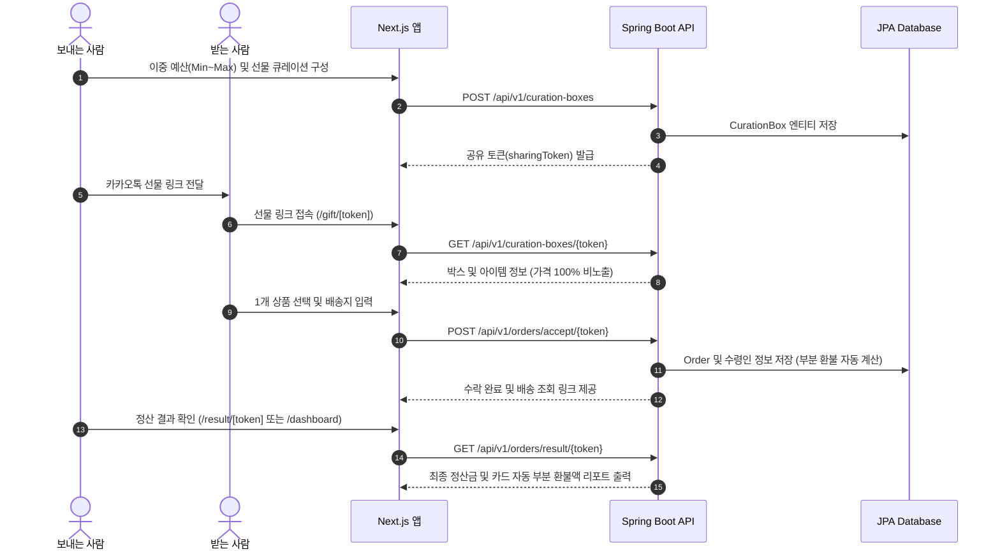

# SharePresent (선물 제안형 프리미엄 큐레이션 플랫폼)

> **"보내는 이의 예산 범위 안에서, 받는 이에게 가장 높은 감도의 선택권을 선물하는 럭셔리 라이프스타일 큐레이션 플랫폼"**
> 
> 기존 '카카오톡 선물하기'의 획일적이고 일방적인 선물 방식(Transactional UX)을 탈피하고, 선물을 주는 사람의 품격과 받는 사람의 소중한 취향을 모두 존중할 수 있도록 설계된 풀스택 모바일/웹 서비스입니다.

---

## 1. Product Vision & Target Audience

### 1) Core Vision
기존 모바일 선물하기는 주는 사람이 아이템을 '특정'하여 보냅니다. 이는 받는 사람의 실제 취향을 무시하거나 중복 선물의 문제를 야기합니다.  
**SharePresent**는 보내는 사람이 **'양방향 예산 범위(Min~Max Budget)'와 '감도 높은 큐레이션 팩'**을 선물하면, 받는 사람이 그 범위 내에서 **'자신의 취향에 맞는 최고의 선물 1개'**를 부담 없이 선택할 수 있게 하여 주는 사람의 체면과 받는 사람의 실용성을 극대화합니다.

### 2) Core Philosophy & Security Architecture
- **Zero Price Exposure (수령인 금액 100% 비노출)**: 받는 사람의 화면에는 최소/최대 예산, 상품 가격, 차액 환불 금액 등 '돈' 관련 정보가 단 1자도 노출되지 않습니다. 수령인은 오직 감성 큐레이션 카드와 본인의 취향에만 집중하여 선물을 수락합니다.
- **Transparent Sender Settlement (송신자 감성 정산 리포트)**: 보내는 사람에게만 최종 선택된 상품 가격과 가결제금 간의 차액 카드 자동 부분 취소/환불 내역을 감성 리포트로 제공합니다.
- **Double-Bound Budget Control (이중 예산 범위 설정)**: 획일적인 상한선 설정 외에 최소 예산(Min)과 최대 예산(Max)을 모두 지정하여 정교한 예산 통제가 가능합니다.

---

## 2. Key Features & Screenshots (주요 기능)

### 1) 럭셔리 에디토리얼 룩북 (Editorial Lookbook UI)
인스타그램 소셜 피드 느낌(하트, 좋아요 카운트 등)을 전면 제거하고, 20년 차 마케팅 디렉터와 탑티어 디자이너 팀이 브랜드 컨셉 회의 끝에 디자인한 듯한 명품 카탈로그 / 파이빗 살롱 인비테이션 스타일을 적용했습니다.

### 2) 수령인 전용 실시간 배송 조회 (`/gift/track/[token]`)
선물 수락 완료 후 받는 사람이 자신의 선물이 어떻게 준비되고 있는지 4단계 타임라인(`선물 수락` ➔ `상품 준비중` ➔ `배송 시작` ➔ `배송 완료`)과 택배사 운송장 번호(CJ대한통운 등)로 실시간 조회할 수 있습니다.

### 3) 보내는 사람 전용 대시보드 & 인기 랭킹 (`/dashboard`)
*   **내가 보낸 선물 보관함**: `🟡 수령인 선택 대기 중` 카톡 링크 복사 및 `🟢 수령 완료` 건의 정산 명세서 상세 조회 지원.
*   **🔥 주간 인기 큐레이션 선물 랭킹 (Weekly Popular Choice)**: 선택률 1위 사쉐 퍼퓸, 도자기 머그, 핸드워시 등 브랜드 인기도 데이터를 기반으로 원클릭 선물 상자 생성을 지원합니다.

---

## 3. Tech Stack (기술 스택)

### Backend (`backend/`)
- **Language**: Java 25 (LTS)
- **Framework**: Spring Boot 3.3.x
- **Build Tool**: Gradle 9.5
- **Database**: H2 In-Memory (Dev Sandbox) / PostgreSQL (Production)
- **ORM / Architecture**: Spring Data JPA, RESTful API, Domain-Driven Design (DDD)

### Frontend (`frontend/`)
- **Framework**: Next.js 16 (App Router, Turbopack)
- **Language**: TypeScript
- **Styling**: Vanilla CSS, Tailwind CSS (Custom Editorial Design Tokens)
- **Deployment**: Vercel / Static Export

---

## 4. API Specifications (핵심 REST API)

| Domain | Method | Endpoint | Description |
| :--- | :--- | :--- | :--- |
| **Curation** | `POST` | `/api/v1/curation-boxes` | 이중 예산 범위(Min/Max) 및 추천 큐레이션 박스 생성 |
| **Curation** | `GET` | `/api/v1/curation-boxes/{token}` | 수령인용 큐레이션 박스 조회 (가격 정보 100% 비노출) |
| **Order** | `POST` | `/api/v1/orders/accept/{token}` | 수령인 선물 수락 및 배송지 입력 (자동 샌드박스 주문 생성) |
| **Order** | `GET` | `/api/v1/orders/result/{token}` | 보낸 이 전용 최종 정산 명세서 및 자동 부분 환불 조회 |

---

## 5. System Sequence Diagram



---

## 6. Project Directory Structure

```
sharepresent/
├── README.md             # 프로젝트 통합 기술 및 제품 명세서
├── index.html            # [Phase 0] 서버 비용 $0 단일 HTML 데모 프로토타입
├── backend/              # [Spring Boot 3] 자바 백엔드 REST API 서버
│   ├── src/main/java/com/sharepresent/
│   │   ├── domain/curation/ # 큐레이션 도메인 (엔티티, DTO, 서비스, 컨트롤러)
│   │   ├── domain/order/    # 주문 및 정산 도메인
│   │   └── domain/product/  # 럭셔리 상품 큐레이션 도메인
│   └── build.gradle
└── frontend/             # [Next.js 16] 럭셔리 에디토리얼 프론트엔드 웹 앱
    ├── src/app/          # Next.js App Router (페이지 및 동적 라우트)
    │   ├── page.tsx          # 큐레이션 박스 설계 (송신자)
    │   ├── dashboard/       # 내가 보낸 선물 보관함 & 인기 랭킹
    │   ├── gift/[token]/    # 수령인 선물 선택 및 주소지 입력 (가격 비노출)
    │   ├── gift/track/[token]/ # 수령인 실시간 4단계 배송 조회
    │   └── result/[token]/  # 송신자 전용 정산 명세서
    ├── src/components/   # Lookbook UI 공용 컴포넌트
    └── src/lib/api.ts    # REST API 클라이언트 모듈
```

---

## 7. How to Run (로컬 구동 가이드)

### 1) 백엔드 서버 실행 (Spring Boot)
```bash
cd backend
./gradlew bootRun
```
*   **포트**: `8081` (로컬 8080 충돌 방지 설정 적용됨)
*   **Swagger API 문서**: `http://localhost:8081/swagger-ui/index.html`

### 2) 프론트엔드 실행 (Next.js)
```bash
cd frontend
npm install
npm run dev
```
*   **포트**: `3000`
*   **접속 주소**: `http://localhost:3000`

---

## 8. License & Contact
- **Project Lead**: juhee
- **Repository**: [https://github.com/juhee77/share-present.git](https://github.com/juhee77/share-present.git)
